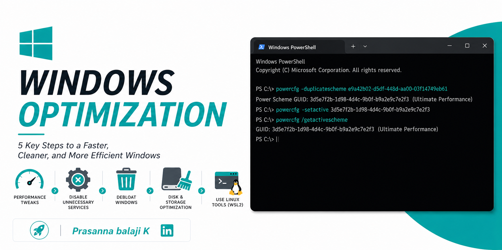
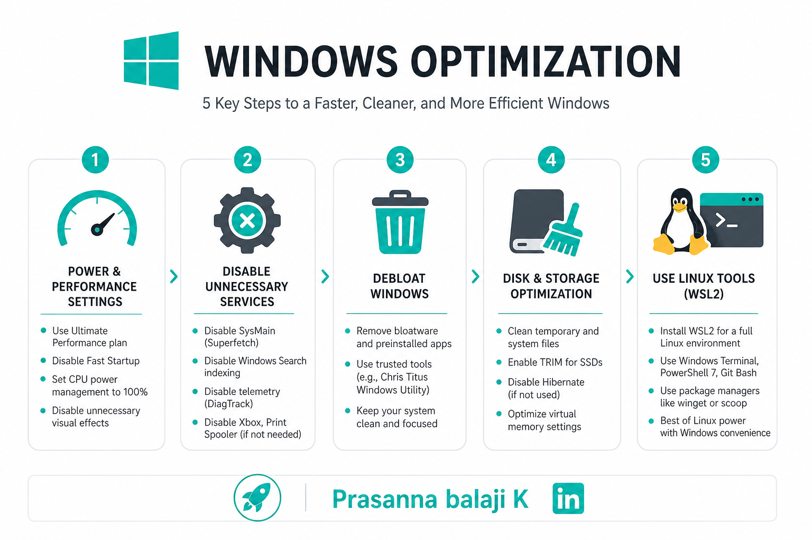

<p align="center">
  
</p>

# Make Windows Think It's Linux - A Complete Performance Optimisation Guide


<p align="center">
  
</p>

**1. Power & Performance Settings**

- Set power plan to **Ultimate Performance** (run in CMD as admin: `powercfg -duplicatescheme e9a42b02-d5df-448d-aa00-03f14749eb61` then select it in Power Options)
- Disable **Fast Startup** — it causes partial shutdowns and memory issues (Power Options → Choose what power buttons do → uncheck Fast Startup)
- Set **Processor power management** min/max to 100% in advanced power settings

---

**2. Disable Bloat & Background Services**

Run `services.msc` and set these to **Disabled** or **Manual:**
- SysMain (Superfetch) — wastes RAM pre-loading apps
- Windows Search indexing — kills disk I/O on HDDs
- DiagTrack (telemetry) — constant background phoning home
- Windows Update Delivery Optimization
- Xbox services (if not a gamer)
- Print Spooler (if no printer)

---

**3. Debloat Windows**

Run this in PowerShell as admin — removes preinstalled junk:
```powershell
iwr -useb https://christitus.com/win | iex
```
This is the **Chris Titus Tech Windows Utility** — widely trusted, open source. Lets you remove bloatware, apply tweaks, and install apps cleanly.

---

**4. Registry & System Tweaks**

- Disable **visual effects** → Right click This PC → Properties → Advanced → Performance Settings → Adjust for best performance
- Disable **transparency & animations** in Settings → Personalisation → Colors
- Set **virtual memory** manually (1.5x your RAM as initial, 3x as max) instead of letting Windows manage it
- Enable **Hardware Accelerated GPU Scheduling (HAGS)** if on a modern GPU — Settings → Display → Graphics Settings

---

**5. Disk & Storage**

- Run `cleanmgr /sageset:65535 && cleanmgr /sagerun:65535` in CMD to deep clean system files
- Enable **TRIM** for SSDs: `fsutil behavior set DisableDeleteNotify 0`
- Disable **Hibernate** if you don't use it (frees GBs): `powercfg -h off`
- Move temp files to a RAM disk (using **ImDisk** or **OSFMount**) — huge speed boost for compilation and temp-heavy work

---

**6. Network Optimisation (Linux-like tuning)**

Open PowerShell as admin and run:
```powershell
netsh int tcp set global autotuninglevel=normal
netsh int tcp set global congestionprovider=ctcp
netsh int tcp set supplemental template=internet
```
- Set your DNS to **1.1.1.1** (Cloudflare) or **8.8.8.8** (Google) — faster than ISP default
- Disable **Nagle's algorithm** in registry for lower latency (good for dev/gaming): set `TcpAckFrequency = 1` and `TCPNoDelay = 1` under `HKLM\SYSTEM\CurrentControlSet\Services\Tcpip\Parameters\Interfaces`

---

**7. Use Linux Tools ON Windows**

This is the biggest game changer — you don't have to give up Linux:

- **WSL2 (Windows Subsystem for Linux)** — run a full Ubuntu/Debian/Kali kernel inside Windows
  ```powershell
  wsl --install
  ```
- **Windows Terminal** — replace CMD/PowerShell with a proper tabbed terminal
- **Scoop or Winget** — package managers like `apt` for Windows
  ```powershell
  winget install <package>
  ```
- **PowerShell 7** — much more powerful than the built-in version
- **Git Bash** — Unix-style shell on Windows

---

**8. Kernel & Memory**

- Disable **Memory Integrity** (Core Isolation) if not needed — it adds overhead: Settings → Windows Security → Device Security → Core Isolation
- Increase **IRQ priority** for your GPU/NIC using **MSI Mode** (Message Signaled Interrupts) via **MSI Utility v3**
- Set **pagefile on your fastest drive** (NVMe if you have one)

---

**9. Startup & Process Control**

- `msconfig` → Boot → Advanced → set CPU cores to maximum
- Task Manager → Startup → disable everything non-essential
- Use **Process Lasso** (free tier) for real-time CPU priority management — similar to Linux's `nice` and `cpuset`

---

**10. Developer-Specific (if you code)**

- Use **VSCode** with WSL2 remote extension — your code runs on Linux, your UI runs on Windows. Best of both worlds
- Mount your WSL2 filesystem as a network drive for easy access
- Set WSL2 memory limits in `C:\Users\<you>\.wslconfig`:
  ```ini
  [wsl2]
  memory=8GB
  processors=6
  swap=4GB
  ```

---

The single biggest wins are: **Ultimate Performance power plan + disabling SysMain + WSL2 + debloat script.** Those four alone will make your machine feel dramatically faster and more like a Linux environment.
